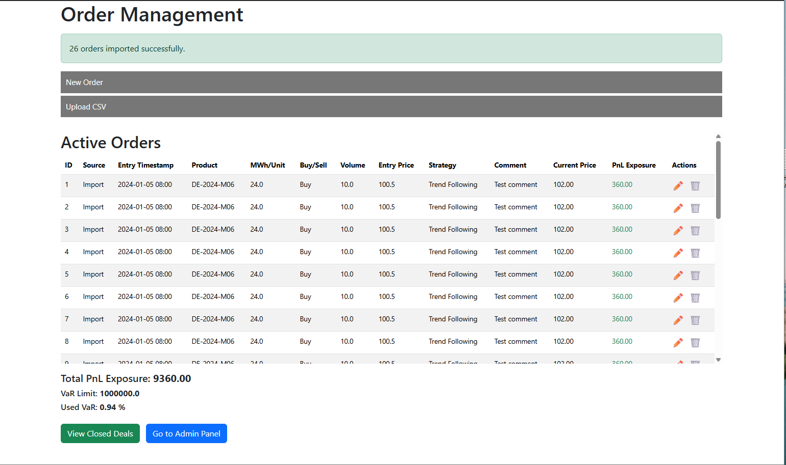
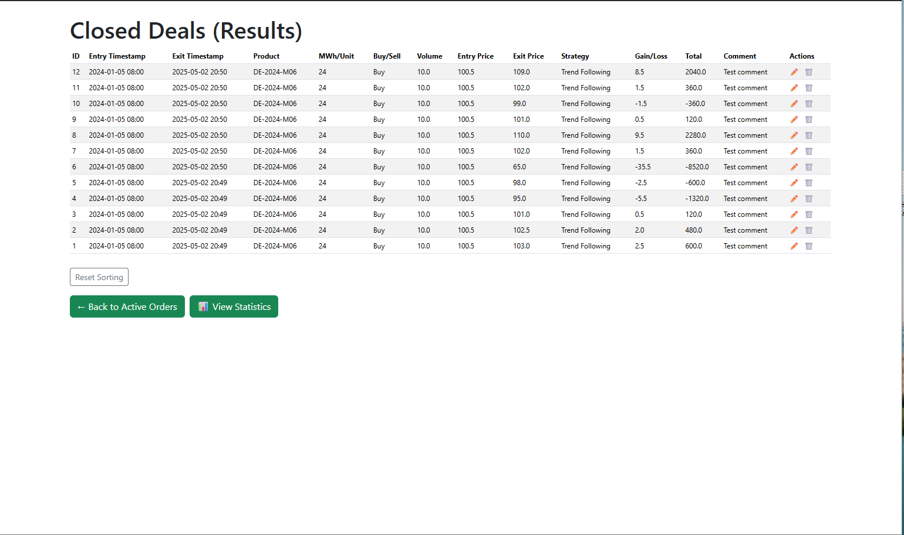
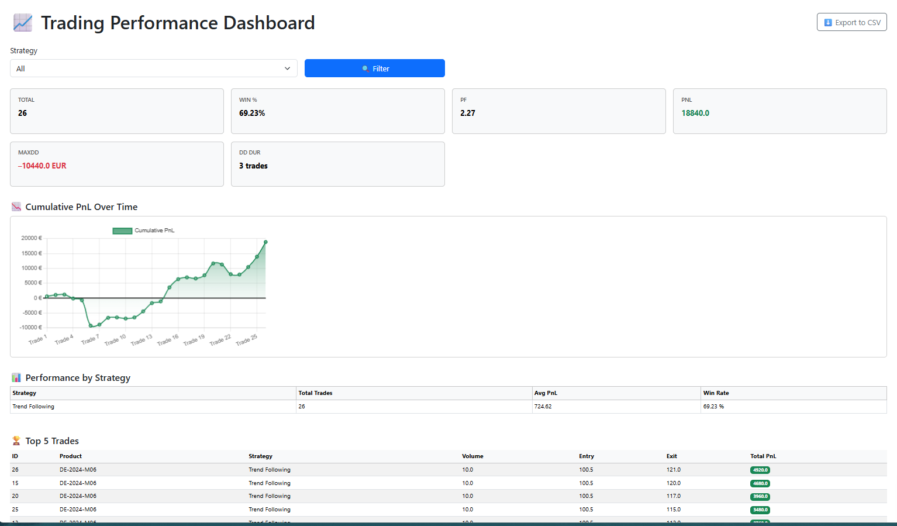

# 📊 Position Tool Web App

A web-based internal tool for managing, analyzing, and recording trading positions — designed primarily for energy trading workflows.

It includes:

- A dashboard for entering and editing open orders
- A registry of closed deals with full exposure and PnL history
- A statistics page with performance metrics (drawdown, profit factor, strategy breakdown, etc.)
- CSV import support using prepared templates
- CSV export functionality

---

## 🚀 Getting Started

1. **Clone the repository**:
   ```bash
   git clone https://github.com/ondrej-bajer/Position-tool-web-app.git
   cd Position-tool-web-app
   ```

2. **Create and activate a virtual environment**:
   ```bash
   python -m venv venv
   source venv/bin/activate  # On Windows: venv\Scripts\activate
   ```

3. **Install dependencies**:
   ```bash
   pip install -r requirements.txt
   ```

4. **Run the application**:
   ```bash
   flask run
   ```

---

## 📁 Why are CSV templates included?

This application supports importing structured data via CSV. Templates are included to provide users with a consistent format for bulk loading data.

| File                             | Purpose                                                        |
|----------------------------------|----------------------------------------------------------------|
| `active_orders_template_import.csv` | For importing open trading positions                          |
| `products.csv`                   | Provides product names for dropdown selection in the app       |
| `current_prices.csv`             | Simulates live prices for calculating real-time PnL exposure   |

These templates act as starter files for testing and operational use.
---

## 📸 Screenshots





---

## 📂 Project Structure

```
├── app.py              # Main Flask app logic
├── models.py           # SQLAlchemy ORM models
├── forms.py            # WTForms form definitions
├── templates/          # Bootstrap 5-based HTML templates
├── *.csv               # CSV import/export templates
└── requirements.txt    # Python dependencies
```

---

## 📄 License

This project is licensed under the [MIT License](LICENSE).  
You are free to use, modify, and distribute it with attribution.

---

## ✉ Contact

For suggestions or questions: [bajer.o@centrum.cz](mailto:bajer.o@centrum.cz)
